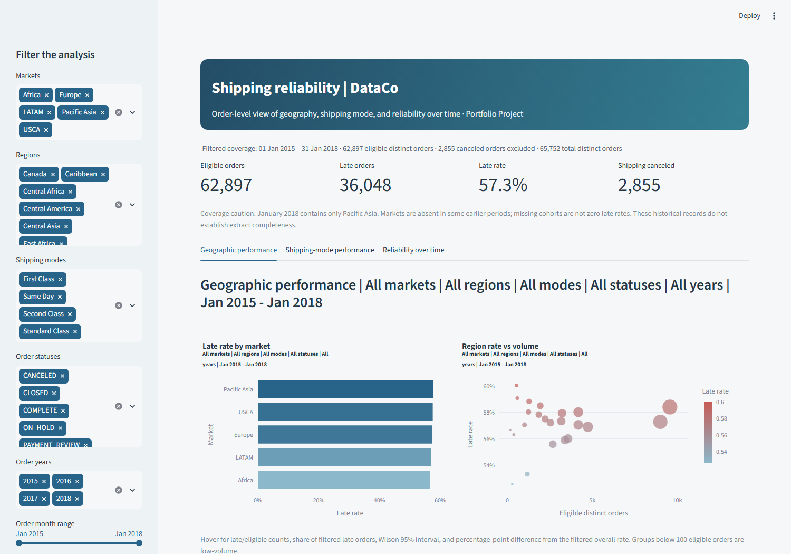

# Supply Chain & Operations Analytics - DataCo

**Portfolio Project | Python analysis and interactive Streamlit dashboard**

This project helps an operations manager identify concentrations of late shipping, assess service classes against recorded commitments, and interpret reliability over time. The aim is to prioritize investigation using order counts, rates and source limitations rather than assume a cause.

## Dashboard preview

## Three analytical questions

1. Which markets and regions have the highest late-shipping rates and the largest late-order volumes?
2. How does each shipping mode perform relative to its scheduled duration?
3. Has reliability changed over time, and how much do market coverage and service mix limit comparisons?

## Tools and project role

Python 3.11; pandas and NumPy for cleaning and calculations; Matplotlib for exported charts; openpyxl for the workbook; ReportLab for the PDF; Streamlit and Plotly for the interactive dashboard. PyMuPDF, Playwright and Streamlit AppTest supported local verification.

**My role:** I guided the business questions and reviewed the findings and business interpretation. AI-assisted Python implementation generated the analysis and dashboard. GitHub Copilot started the implementation; Codex preserved useful work, completed the deliverables and applied the reviewed refinements.

## Leading findings

- **36,048 / 62,897 eligible orders are late (57.31%).** The remaining 2,855 Shipping canceled orders are reported separately; 65,752 total orders come from 180,519 unique item rows and 53 columns.
- Market rates are close: 56.55% in Africa to 57.68% in Pacific Asia. Europe contributes the largest late count, 10,199 (28.3%); Western Europe contributes 5,585, the largest region count. Central Africa has the highest regional rate, 60.0% (320/533), with a wide 55.8%-64.1% Wilson interval. Europe and Western Europe are investigation priorities because of late-order volume, not evidence of unusually high rates. Ranking alone is insufficient to establish a reliability problem.
- First Class: 9,602/9,602 late (100%); Second Class: 9,803/12,256 (80.0%); Same Day: 1,648/3,407 (48.4%); Standard Class: 14,995/37,632 (39.8%). Late-only median recorded gaps are 1, 3, 1, and 2 days respectively. Every eligible First Class order records actual_days = 2 and scheduled_days = 1. This uniform pattern requires definition/source validation; no cause is established. Different commitments and mixes prevent causal mode-switching claims.
- Full-year rates are 57.17%, 57.61%, and 57.03% in 2015-2017: the pooled figures do not show a sustained directional pattern, but changing geographic coverage limits global comparisons. January 2018 is 58.66%, but contains only Pacific Asia. Excluding it gives 57.27%; COMPLETE/CLOSED sensitivity gives 57.42% (16,633/28,965).

## Source and attribution

Constante, Fabian; Silva, Fernando; Pereira, António (2019). **DataCo SMART SUPPLY CHAIN FOR BIG DATA ANALYSIS**, Mendeley Data, version 5, published 12 March 2019. DOI: 10.17632/8gx2fvg2k6.5. [Publisher dataset and downloads](https://data.mendeley.com/datasets/8gx2fvg2k6/5). Publisher license: [CC BY 4.0](https://creativecommons.org/licenses/by/4.0/). This project contains transformed and aggregated derivatives; retain this attribution.

Download **DataCoSupplyChainDataset.csv** and **DescriptionDataCoSupplyChain.csv** from the publisher’s version 5 files, then place both beside analyze.py. They are excluded from this release, as are detailed order/item extracts. Source SHA-256 hashes are recorded in [source_manifest.json](outputs/source_manifest.json). The original files in the working project remain unchanged. Reproduction creates local detailed extracts and a workbook; those generated files should remain outside any aggregate-only portfolio release.

## Reproduce and run

Python 3.11 was used. In PowerShell from this project folder:

~~~powershell
py -3.11 -m venv .venv
.\.venv\Scripts\python.exe -m pip install -r requirements.txt
.\.venv\Scripts\python.exe analyze.py --portfolio
.\.venv\Scripts\python.exe -m streamlit run dashboard.py --browser.gatherUsageStats false
~~~

Open http://localhost:8501 . All dashboard filters apply to every track and metric. Empty and single-month selections are handled. Trends use calendar months: missing selected months have no monthly rate, and the rolling rate sums counts across calendar windows. Filters can make comparisons sparse or create partial windows.

Run these commands from the extracted `portfolio_release` folder after downloading both source files. Dependencies are pinned in [requirements.txt](requirements.txt). The analysis validates and transforms the originals without modifying them. Run the dashboard after the pipeline finishes; the supplied aggregate CSVs alone do not replace its order-level runtime input. Stop Streamlit with Ctrl+C. No cloud account or publication step is required.

## Portfolio deliverables

- [Final portfolio PDF](outputs/report/DataCo_Operations_Analytics_Portfolio_Project.pdf): reviewed findings, recommendations, methodology and supporting visuals.
- [Dashboard screenshot](outputs/dashboard_screenshot.png): local browser preview.
- [PNG charts](outputs/charts): nine labeled figures, including the coverage-aware time and comparable-market views.
- [Aggregate CSV summaries](outputs/csv): 36 analytical and audit tables, with no detailed order/item records.
- [Validation results](outputs/verification.json): reconciled source, workbook, report and dashboard checks from the reviewed working project.
- [Analysis code](analyze.py) and [dashboard code](dashboard.py), with supporting modules and local Streamlit configuration.

The release excludes raw source data, the detailed workbook, order/item extracts, virtual environments, caches, temporary previews and local environment details. Those working artifacts remain in the original project. `release_manifest.json` records release-file hashes and checks of relative README links.

## Methods and metric definitions

Source grain is an order item, verified by unique Order Item Id and consistency of market, region, statuses, mode, durations, risk and timestamps within each Order Id. Shipping calculations use one row per validated order.

Primary population: Advance shipping, Shipping on time, Late delivery. Late orders: eligible orders labeled Late delivery. Late rate = late / eligible distinct orders. Canceled shipping remains separate. COMPLETE/CLOSED is a sensitivity population, not the definitive denominator; suspected fraud is not confirmed fraud. Order status is examined without automatically excluding otherwise labeled outcomes.

Recorded gap = actual days - scheduled days. Monthly trends use order month, with month-over-month and year-over-year percentage-point changes, weighted three-calendar-month late rates and quarterly checks. Wilson 95% intervals accompany rates; fewer than 100 eligible orders is a reporting guardrail, not a significance cutoff. Intervals do not address selection bias, source errors or repeated-customer dependence.

Common-mode standardization applies overall eligible mode weights to each geography/year's within-mode rates. Missing modes are not imputed; adjusted rates are unavailable if any mode is absent. In supplemental standardization and mode-by-year tables, sum means late-order count and count means eligible-order count. This is descriptive adjustment, not a causal model. Geography-by-mode and geography-by-year tables reveal changing coverage and sparse strata.

## Cleaning and quality

Read Latin-1, trim surrounding text whitespace, parse timestamps, derive eligibility/late/canceled flags, duration gaps and calendar periods. Retain mixed-language geography labels and original durations; no postcode imputation. Field-level dispositions are exported. Personal names, email/password, street, customer identifiers, coordinates and image URLs are excluded from cleaned outputs.

Product Description is entirely missing; Order Zipcode is 86.24% missing; Customer Lname has 8 missing values and Customer Zipcode has 3. Seven pairs of fields duplicate exactly. Two category IDs share Electronics. These are measured properties rather than a fabricated overall quality score.

All eligible late labels equal positive recorded gaps. All 3,571 Same Day orders (9,737 items) have a 12-hour order-to-shipment timestamp interval, with integer actual duration 0 or 1. This requires convention clarification, not overwriting. The dictionary explicitly calls the timestamp shipment time; verified delivery-arrival events are absent.

Financial arithmetic and negative profits are audited, retained and excluded from operational financial claims. Currency is undocumented. Sales equals quantity times price within 0.01; some total residuals slightly exceed 0.01 at rounding boundaries. Ratio identities have larger discrepancies requiring definition review. Negative profits are observations, not automatic errors; late-associated sales are not lost revenue.

## Interpretation and limitations

Geographic coverage shifts sharply: Africa is absent in 2015, LATAM in 2016, and January 2018 contains only Pacific Asia. A missing cohort is not a zero late rate. Non-missing status labels and a full final calendar month do not establish extraction completeness. This historical extract is not current operations evidence.

Observed rates do not establish causation or the effect of switching shipping mode. The dataset supplies no supplier histories, inventory movements, warehouse stock or verified delivery-arrival timestamps. Review currency, ratio definitions, Same Day rounding and ambiguous postcode/location definitions with the source owner.

## AI-assisted workflow and verification

The business questions and reviewed interpretation were guided by the project owner. AI-assisted Python implementation produced the reproducible analysis and dashboard. Automated reconciliations and local visual checks support the implementation; they do not resolve ambiguous source definitions or establish causal effects. The portfolio presentation preserves the reviewed calculations and limitations.

## Comparable-market trend sensitivity

In each market, include every maximal continuous run of at least six calendar months with at least 100 eligible orders in every month. Select runs by coverage only, not outcome. Compare count-weighted first-three-month and last-three-month late rates. Five windows qualify: Africa August 2016-January 2017 (+2.80 pp); Europe June-November 2017 (-0.38 pp); LATAM January-June 2017 (-0.81 pp); Pacific Asia October 2015-March 2016 (+1.02 pp) and August 2016-January 2017 (-1.44 pp). Directions vary. Region/mode/order mix can still change, and no market has qualifying uninterrupted coverage across the full extract. This sensitivity does not establish a like-for-like full-period global trend. Counts, rates and inclusion dates are in comparable_market_summary.csv and comparable_market_monthly.csv, the workbook, report and dashboard.

Dashboard chart and section titles reflect active filters. Validation tests Pacific Asia in January 2018 as a nonempty single-month case (2,037 eligible orders, 1,195 late), then tests an empty market selection separately (0 eligible orders and an empty-selection message).

Workbook export streams rows to keep memory use bounded, then restores explicit worksheet dimensions and cached late-rate formulas. Final verification reconciles all analytical summaries and the added review tables against their CSVs; the nine-page report and workbook previews are visually inspected.
